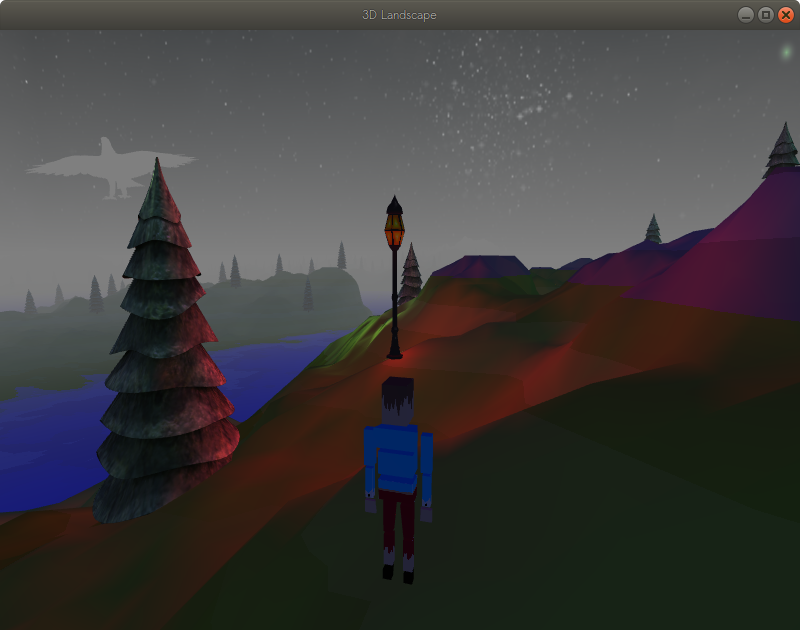
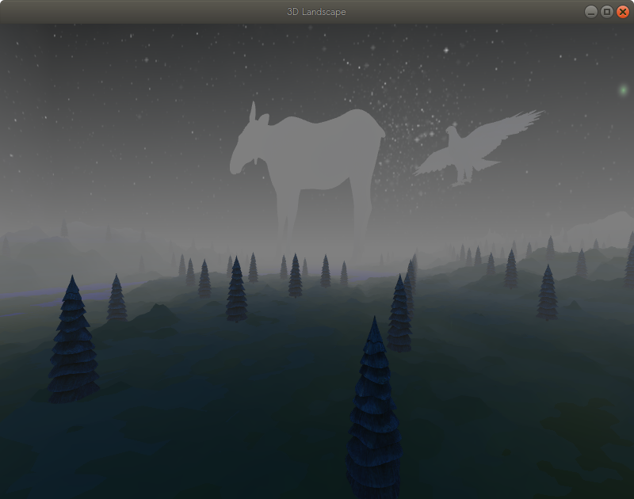
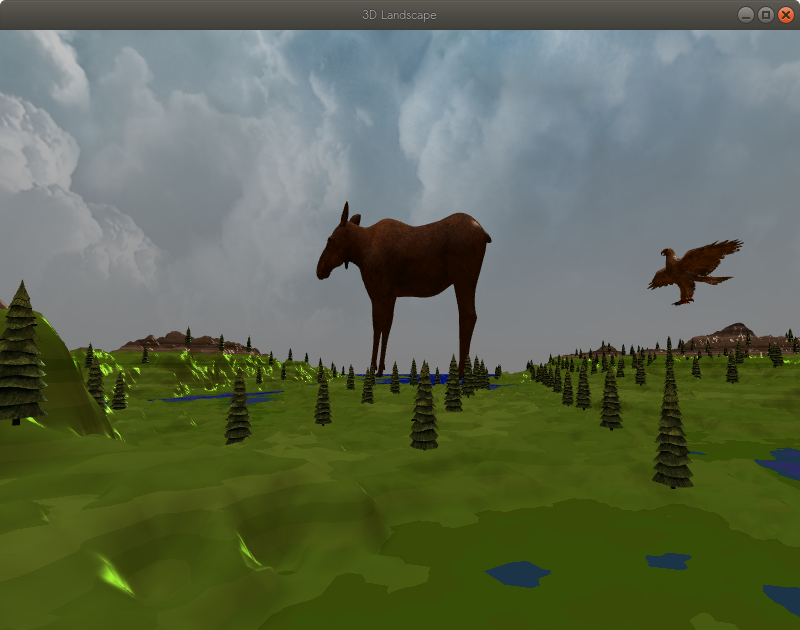
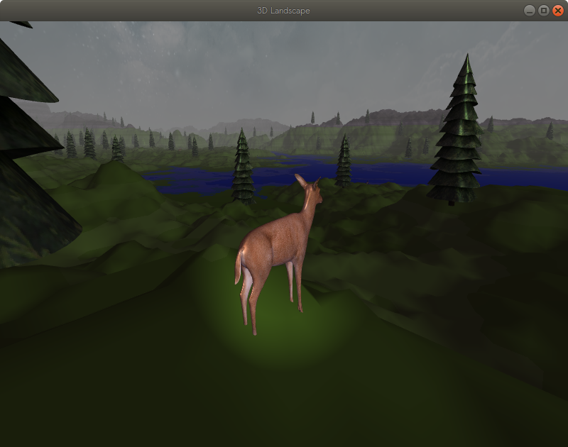

# OpenGL 3D Landscape

This project was made for take home exam in the course Graphics Programming - IMT2531.
For more information check resources/assets/




## How to setup

Make sure you have [cmake](https://cmake.org/) version 3.14 or later installed.
Navigate to the root folder of the project and execute the following commands

On linux:
```
mkdir build
cd build
cmake ..
make
./Exam
```

On windows:
```
mkdir build
cd build
cmake ..
cmake --build .
cd ..
cd out/build/x64-Debug
Exam.exe
```

## Controls

W - Move player forward

A - Move player left

S - Move player backwards

D - Move player right

F - Toggle flashlight

M - Switch between first-person, third-person and top down view

T - If on first-person press T to switch to a all around movable camera

LShift - Sprint

Esc - Pause the game

Arrow keys - Navigate the menu

Space - Make a selection in the menu

## Functionality


[1.0]([https://github.com/VisarBuza/imt2531_exam_2020/commit/76454c11b10a6feb80be5ac2ea1d0dab19828816](https://github.com/VisarBuza/imt2531_exam_2020/commit/76454c11b10a6feb80be5ac2ea1d0dab19828816)) - Loaded a a terrain from one of the given height maps, the terrain is textured differently depending on the height at the certain point. The terrain has also trees scattered around the map, mostly on the green levels.

[1.1]() - The terrain is illuminated by the Phong model, it has one general directional light that is the sun, point lights scattered around the map, and also the player`s flashlight which can be toggled.

[Additional]() - The scene has a skybox implemented that changes dynamically depending on the time of day.
Also and additional feature i have implemented fog which comes up during the night and goes away by day giving  the scene a realistic feeling.

[2.0]() - The game has a free moving camera that is controlled by the mouse values and the WASD keys. You can lock the camera to the player using T. After that you can switch the camera into FIRST PERSON, THIRD PERSON or 2D top down view.

[2.1]() -The sun(directional light) changes its angle according to the day night cycle, it also changes its color. Except for the directional light changing, the skybox also changes accordingly. This is done by using two different textures and blending between them with a factor that depends on the time of day.

[Additional]() - Camera has a zoom functionality using the scroll wheel on the mouse.
I also have implemented some different pointlights as lamps scattered around the map, iluminating green or red light.
Also there is another light source, a spotlight which is the players flashlight which you can toggle with F.

[3.0]() - I have loaded several land-, air-, water-based models, there is a giant moose, and also a giant eagle flying over you. Ducks are scattered around the water and the small deers are scattered around the green areas of the map.

[3.1]() - The eagle flies in the air space and has some fluctuation on altitude bus mostly circles in the xOz plane. There is somewhat of a collision detection, the objects cannot go throught ground, they are all pulled by the gravity and locked at terrain height.

## Future Work

Use the normal maps for producing more realistic scenes.

There is te AI class from Assignment 2 which uses A* searching algorithm which works perfectly with the ghosts in assignment 2. I did not have time to use that in the exam. But i want to use that so deers can use that algorithm to move around the map and go after some food around the map.

I would also like to work on a proper physics engine, my general idea is that each object every update calculates the general net force(friction, gravity, etc) acting on it at that moment in time and based on the net force calculates the accelaration which then would calculate the current speed and than the next position in the world.